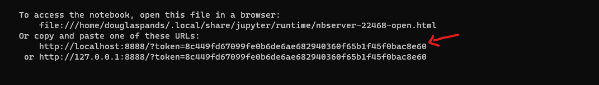
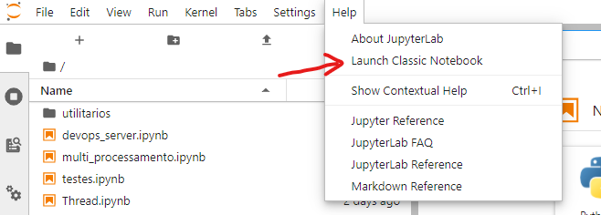
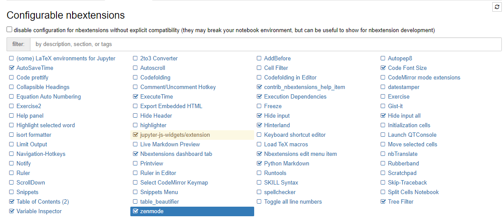

# Jupyter Notebook
Jupyter notebook pessoal com algumas experiencias e testes.

## Requisitos
- [Python](https://www.python.org/) (foi utilizado a versão `3.8.10`)
- [Poetry](https://python-poetry.org/)

## Como usar
1. Instalar as dependencias:
```shell
poetry install
```

2. Instalar e configurar extensões do `Jupyter Classic`:
```shell
poetry run install_extensions
```

3. Iniciar o Jupyter:
```shell
poetry run start
```

4. Acessar url descrito no terminal (conforme exemplo abaixo):


5. Alternar para o modo Classic:


6. Ativas extensões do `Jupyter Classic` recomendado conforme na imagem abaixo:


## Opcionais

1. Gerar requirements.txt:

```shell
poetry run requirements
```
