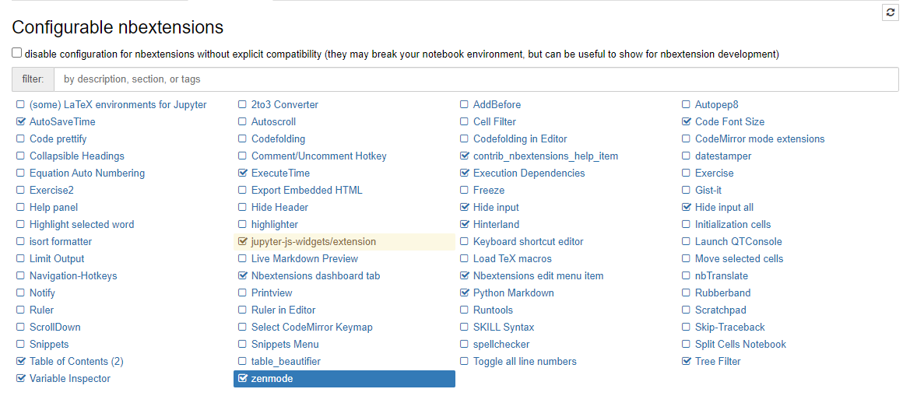

# Jupyter Notebook

Jupyter notebook pessoal com algumas experiencias e testes.

## Requisitos

- Python (preferência ao 3.8)
- Pip
- Poetry

## Instalação Padrão

```shell
poetry install
```

## Instalar extensões (RECOMENDADO)
```shell
poetry run install_extensions
```

## Iniciar Jupyter

```shell
poetry run start
```

## Gerar requirements.txt (Opcional)

```shell
poetry export -f requirements.txt > requirements.txt
```

## Extensões padrões


